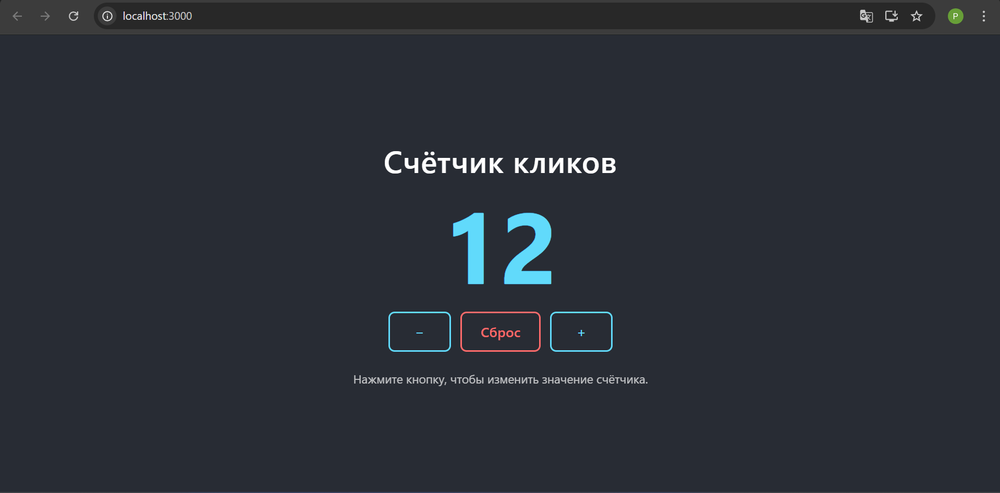

# Счётчик кликов на React в Docker

Минимальное React-приложение «Счётчик кликов», упакованное в Docker через
многоступенчатую сборку (`node:alpine` → `nginx:alpine`). Это финальная
лабораторная работа №3: образ собирается командой `docker build`, после чего
готовая статика раздаётся nginx внутри контейнера.

## Возможности приложения

- Отображение текущего значения счётчика.
- Кнопка `+` увеличивает значение на 1.
- Кнопка `−` уменьшает значение на 1 (значение может быть отрицательным).
- Кнопка `Сброс` возвращает счётчик к 0.

## Скриншот





## Стек

- React 19 (Create React App)
- Node.js 20 (этап сборки)
- Nginx alpine (этап раздачи статики)
- Docker / Docker Compose

## Локальный запуск без Docker

```bash
npm install
npm start
```

Приложение откроется по адресу `http://localhost:3000`.

Запуск тестов:

```bash
npm test
```

Production-сборка статики (попадает в папку `build/`):

```bash
npm run build
```

## Сборка Docker-образа

Из корня проекта (там, где лежит `Dockerfile`):

```bash
docker build -t my-react-app .
```

## Запуск контейнера

```bash
docker run -d -p 8080:80 --name my-app my-react-app
```

После запуска приложение доступно по адресу
[http://localhost:8080](http://localhost:8080).

Порт хоста (`8080`) можно заменить на любой другой, например `3000:80`.

## Запуск через docker-compose

В проекте есть `docker-compose.yml`. Команда поднимет сервис в фоне:

```bash
docker-compose up -d --build
```

Остановить и удалить:

```bash
docker-compose down
```

## Полезные команды

```bash
# Просмотр запущенных контейнеров
docker ps

# Логи контейнера
docker logs -f my-app

# Остановка и удаление контейнера
docker stop my-app && docker rm my-app

# Удаление образа
docker rmi my-react-app
```

## Структура проекта

```
.
├── public/                # Статика CRA (index.html, иконки, manifest)
├── src/                   # Исходники React-приложения
│   ├── App.js             # Компонент счётчика
│   ├── App.css            # Стили счётчика
│   └── App.test.js        # Юнит-тесты счётчика
├── Dockerfile             # Многоступенчатая сборка (node → nginx)
├── .dockerignore          # Исключения для Docker-контекста
├── nginx.conf             # Конфиг nginx с SPA-fallback и gzip
├── docker-compose.yml     # Compose-описание сервиса app
├── package.json
└── README.md
```

## Как устроен Dockerfile

1. **Этап `build`** на базе `node:20-alpine`: копируем `package*.json`,
   ставим зависимости (`npm ci`, если есть lock-файл), копируем исходники
   и выполняем `npm run build` — получаем production-бандл в `/app/build`.
2. **Этап `production`** на базе `nginx:alpine`: подкладываем `nginx.conf`
   с SPA-fallback и gzip, копируем статику из этапа `build` в
   `/usr/share/nginx/html`, открываем порт `80` и запускаем nginx в
   foreground.

Такой подход даёт компактный финальный образ — в нём нет ни Node.js, ни
исходников, только nginx и собранная статика.
